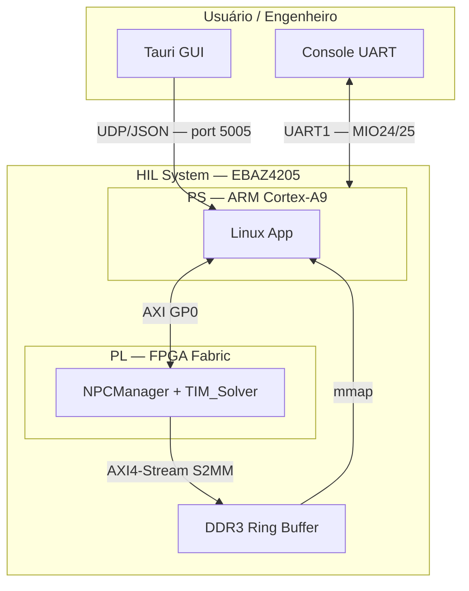
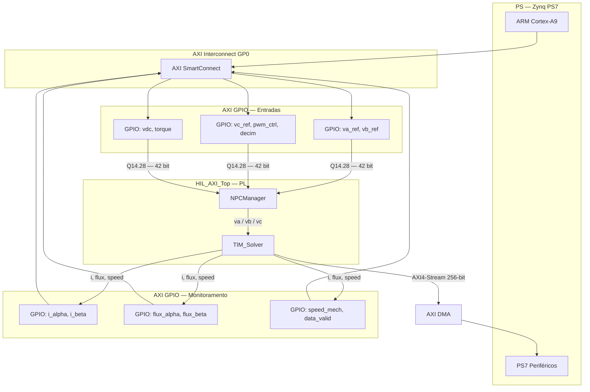
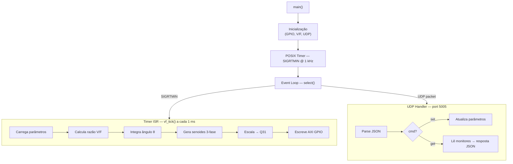
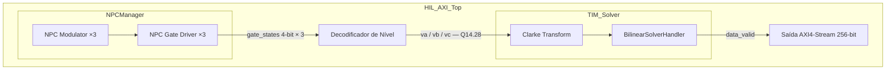
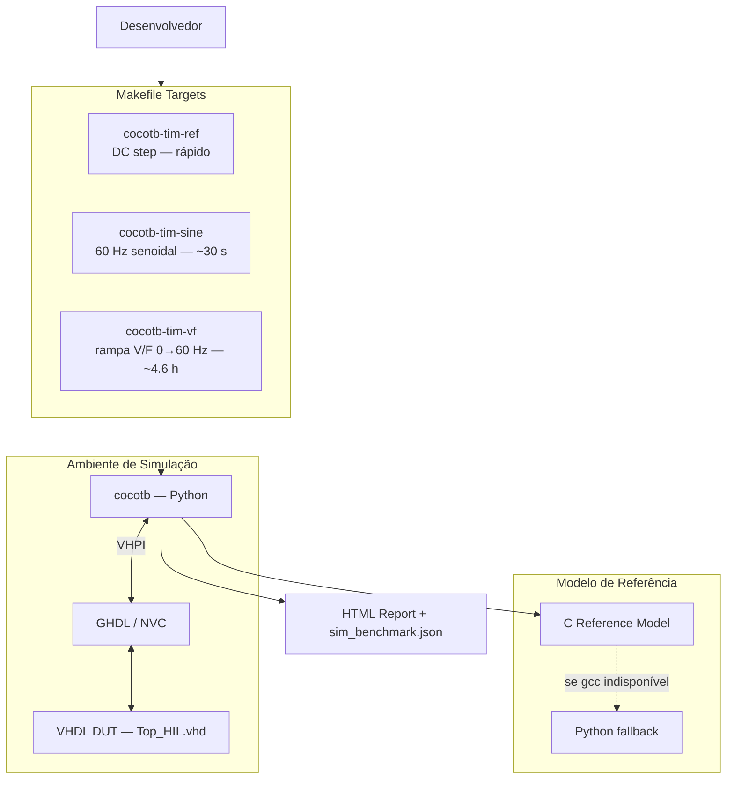
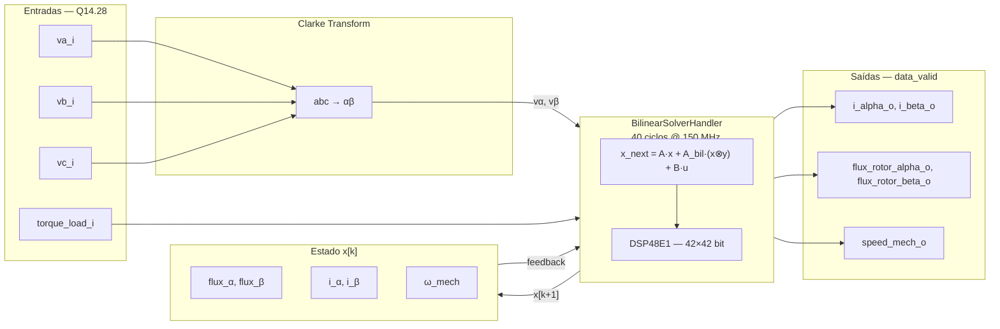
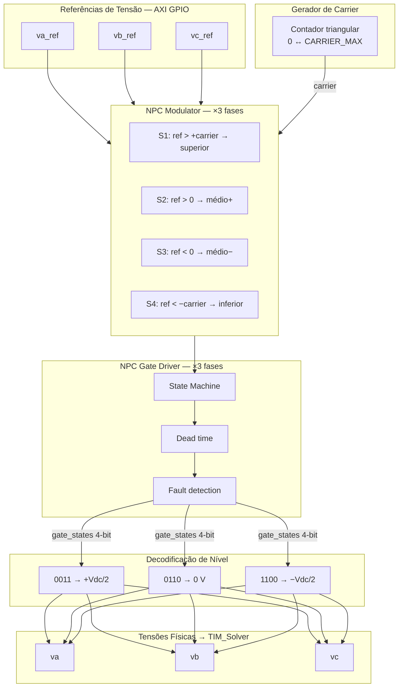

# HIL Architecture — EBAZ4205 (Zynq-7010)

FPGA-based Hardware-in-the-Loop for three-phase induction motor (TIM) simulation.

---

## Table of Contents

1. [System Context](#1-system-context)
2. [PS/PL Integration Overview](#2-pspl-integration-overview)
3. [PS Software Architecture](#3-ps-software-architecture)
4. [PL Block Design](#4-pl-block-design)
5. [Verification Flow](#5-verification-flow)
6. [TIM_Solver Pipeline](#6-tim_solver-pipeline)
7. [NPC Modulator Pipeline](#7-npc-modulator-pipeline)
8. [Referências Rápidas](#8-referências-rápidas)

---

## 1. System Context

Visão de alto nível das interfaces externas do sistema.



> **Plataforma:** PetaLinux 2025.1 / Kernel 6.12.10 — **Clock PL:** FCLK0 @ 150 MHz

---

## 2. PS/PL Integration Overview

Blocos instanciados no Vivado Block Design e mapa de comunicação AXI entre PS e PL.



**Mapa de registradores AXI GPIO:**

| Endereço      | Direção  | Sinais                        |
|---------------|----------|-------------------------------|
| `0x4120_0000` | PL → PS  | `i_alpha`, `i_beta`           |
| `0x4121_0000` | PL → PS  | `flux_alpha`, `flux_beta`     |
| `0x4122_0000` | PL → PS  | `speed_mech`, `data_valid`    |
| `0x4123_0000` | PS → PL  | `vdc_q31`, `torque_q31`       |
| `0x4124_0000` | PS → PL  | `va_ref`, `vb_ref`            |
| `0x4125_0000` | PS → PL  | `vc_ref`, `pwm_ctrl`, `decim` |

**Formato de palavra:** Q14.28 (42 bits) — 14 inteiros + 28 fracionários  
**Pacote DMA:** 256 bits = 5 × 42-bit + 86-bit pad  
**Taxa de saída TIM_Solver:** ~3.75 MHz (40 ciclos × 150 MHz)

---

## 3. PS Software Architecture

Fluxo de execução do software no ARM: inicialização, timer de 1 kHz e handler UDP.



**Parâmetros configuráveis via UDP:**

| Campo       | Descrição                        |
|-------------|----------------------------------|
| `freq_hz`   | Frequência de saída (0–60 Hz)    |
| `vdc_v`     | Tensão do barramento DC          |
| `torque`    | Carga de torque aplicada         |
| `enable`    | Liga/desliga o controlador       |
| `decim`     | Fator de decimação do DMA        |

**Geração senoidal (V/F):**
```
v_pu = Vnom · (f / f₀),  clamped a 1.0
θ[k] = θ[k-1] + 2π · f · Ts

va = A · sin(θ)
vb = A · sin(θ − 2π/3)
vc = A · sin(θ + 2π/3)
```

---

## 4. PL Block Design

Hierarquia interna do `HIL_AXI_Top.vhd` e módulos instanciados na fabric.



**Decodificação de nível NPC:**

| `gate[3:0]` | Tensão de saída |
|-------------|-----------------|
| `0011`      | `+Vdc/2`        |
| `0110`      | `0 V`           |
| `1100`      | `−Vdc/2`        |

**Módulos do `common/` (submodule):**

| Módulo                   | Arquivo                                     | Função                              |
|--------------------------|---------------------------------------------|-------------------------------------|
| `NPCModulator`           | `npc_modulator/NPCModulator.vhd`            | Comparador carrier vs. referência   |
| `NPCGateDriver`          | `npc_modulator/NPCGateDriver.vhd`           | Transições seguras + dead time      |
| `BilinearSolverUnit_DSP` | `bilinear_solver/BilinearSolverUnit_DSP.vhd`| Multiplicador 42×42 em DSP48E1      |
| `BilinearSolverHandler`  | `bilinear_solver/BilinearSolverHandler.vhd` | Orquestra cálculo linha-por-linha   |
| `ClarkeTransform`        | `clarke_transform/ClarkeTransform.vhd`      | abc → αβ (escala 2/3)              |

---

## 5. Verification Flow

Pipeline de verificação — do `make` até o relatório HTML.



**Métricas de validação (rampa V/F):**

| Sinal              | Limiar    | Status | Valor atual |
|--------------------|-----------|--------|-------------|
| NRMSE `i_α`, `i_β` | < 10%     | PASS   | ~2.87%      |
| MAE `flux_α/β`     | < 1 mWb   | FAIL   | ~5.5 mWb    |
| MAE `speed_mech`   | < 2 rad/s | PASS   | ~0.70 rad/s |

> **Simuladores suportados:** GHDL ≥ 4.0 · NVC ≥ 1.19.3

---

## 6. TIM_Solver Pipeline

Fluxo de dados interno do `TIM_Solver.vhd` — das tensões de fase às variáveis de estado do motor.



**Equação de estado (bilinear):**
```
x[k+1] = A · x[k]  +  A_bil · (x[k] ⊗ y[k])  +  B · u[k]

x = [flux_α, flux_β, i_α, i_β, ω_mech]ᵀ   (5 estados)
u = [vα, vβ, torque_load]ᵀ
y = produto bilinear (acoplamento eletromagnético)
```

**Timing:** 40 ciclos × (1/150 MHz) ≈ 266 ns/passo → taxa máxima ~3.75 MHz

**Parâmetros do motor (0.75 kW, 4 polos):**

| Parâmetro | Símbolo | Valor         |
|-----------|---------|---------------|
| Resistência stator  | Rs  | 0.435 Ω       |
| Resistência rotor   | Rr  | 0.2826 Ω      |
| Indutância stator   | Ls  | 3.1364 mH     |
| Indutância rotor    | Lr  | 6.3264 mH     |
| Indutância mútua    | Lm  | 109.9442 mH   |
| Inércia             | J   | 0.192 kg·m²   |
| Pares de polos      | Npp | 2             |

---

## 7. NPC Modulator Pipeline

Fluxo interno do `NPCManager` — da referência de tensão até a tensão física aplicada ao motor.



**Parâmetros do carrier:**

| Parâmetro      | Valor                           |
|----------------|---------------------------------|
| `CARRIER_MAX`  | 75 000                          |
| Frequência     | 150 MHz / (75 000 × 2) = 1 kHz  |
| 100% modulação | ±75 000                         |
| Uso típico     | ±63 750 (≈ 85%)                 |

---

## 8. Referências Rápidas

| Caminho                              | Conteúdo                                   |
|--------------------------------------|--------------------------------------------|
| `src/rtl/HIL_AXI_Top.vhd`           | Wrapper PL com AXI GPIO + DMA              |
| `src/rtl/Top_HIL.vhd`               | Top para simulação (com SerialManager)     |
| `src/rtl/TIM_Solver.vhd`            | Modelo do motor de indução                 |
| `src/ps_app/main.c`                  | Aplicação Linux (event loop, UDP, timer)   |
| `src/ps_app/vf_ctrl.c`              | Controlador V/F                            |
| `common/modules/npc_modulator/`      | NPCManager, NPCModulator, NPCGateDriver    |
| `common/modules/bilinear_solver/`    | BilinearSolverHandler, DSP48E1 wrapper     |
| `common/modules/clarke_transform/`   | ClarkeTransform                            |
| `syn/hil/create_ebaz4205_project.tcl`| Script Vivado BD (PS7, AXI GPIO, DMA)      |
| `verification/cocotb/`               | Testes cocotb + modelo de referência C/Py  |
