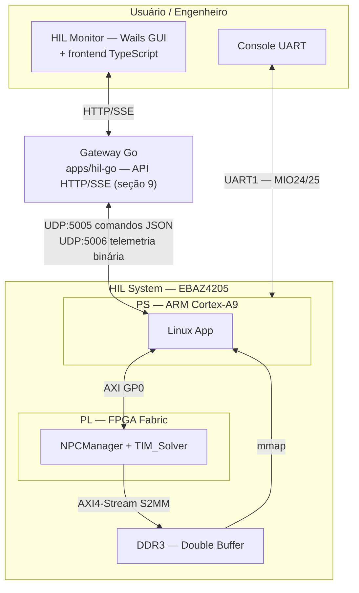
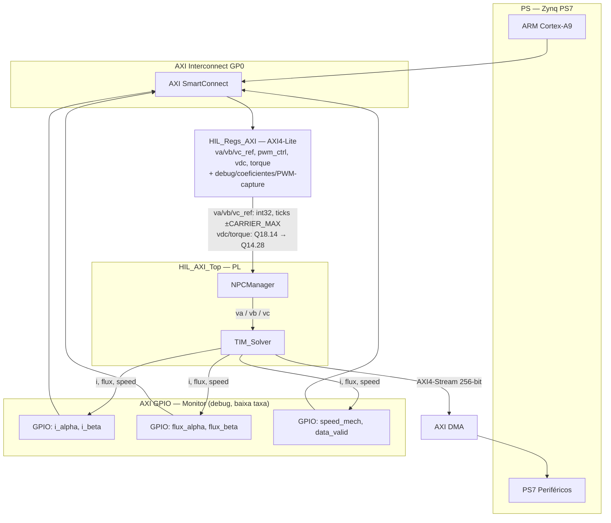
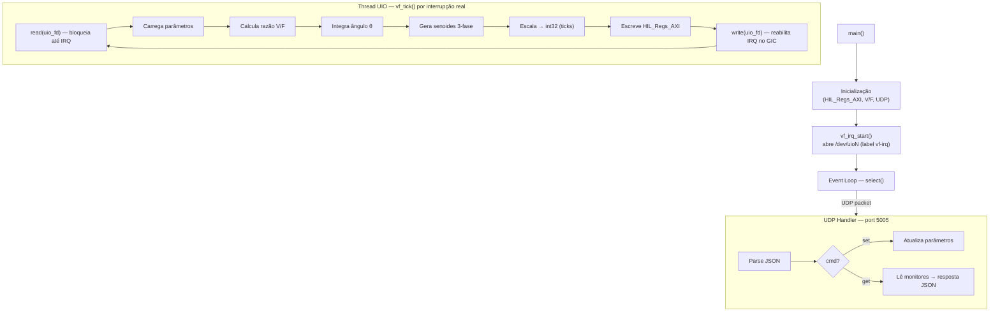
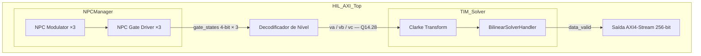
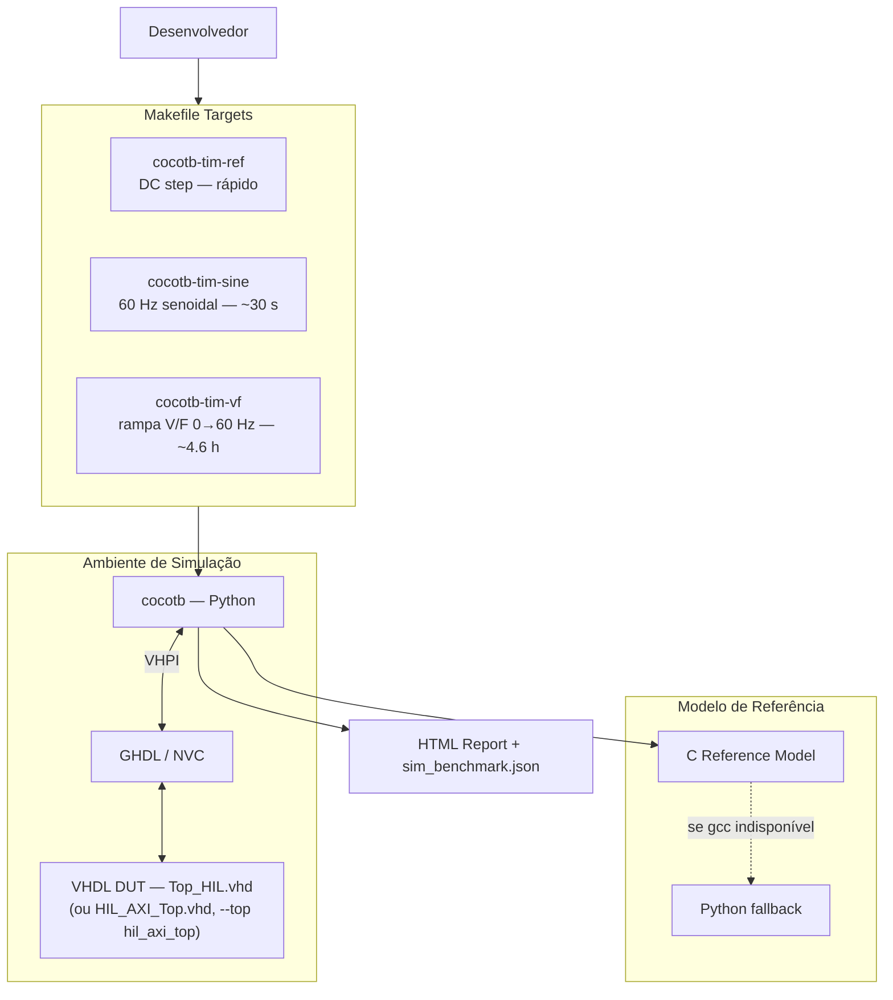
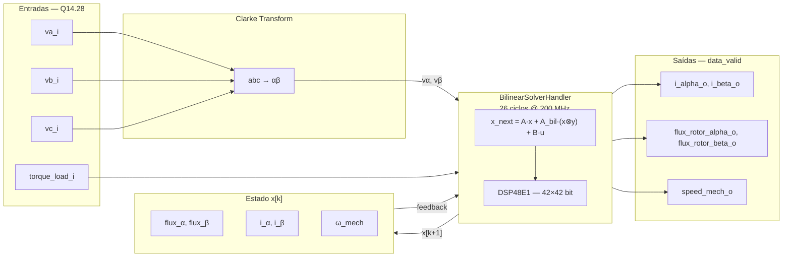
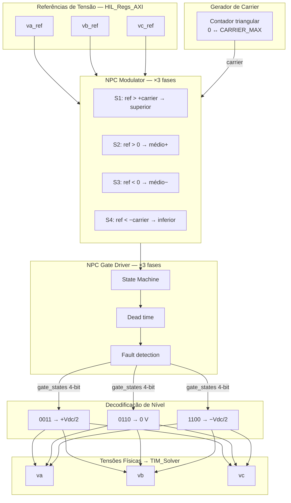

# HIL Architecture — EBAZ4205 (Zynq-7010)

FPGA-based Hardware-in-the-Loop for three-phase induction motor (TIM) simulation.

---

## Table of Contents

1. [System Context](#1-system-context)
2. [PS/PL Integration Overview](#2-pspl-integration-overview)
3. [PS Software Architecture](#3-ps-software-architecture)
4. [PL Block Design](#4-pl-block-design)
5. [Verification Flow](#5-verification-flow)
6. [TIM_Solver Pipeline](#6-tim_solver-pipeline)
7. [NPC Modulator Pipeline](#7-npc-modulator-pipeline)
8. [Referências Rápidas](#8-referências-rápidas)
9. [API de Telemetria e Navegação (HIL Monitor)](#9-api-de-telemetria-e-navegação-hil-monitor)

---

## 1. System Context

Visão de alto nível das interfaces externas do sistema.


```mermaid
flowchart TB
    subgraph USER["Usuário / Engenheiro"]
        GUI["HIL Monitor — Wails GUI\n+ frontend TypeScript"]
        CON["Console UART"]
    end

    GATEWAY["Gateway Go\napps/hil-go — API HTTP/SSE (seção 9)"]

    subgraph HIL["HIL System — EBAZ4205"]
        subgraph PS["PS — ARM Cortex-A9"]
            APP["Linux App"]
        end
        subgraph PL["PL — FPGA Fabric"]
            FPGA["NPCManager + TIM_Solver"]
        end
        DDR["DDR3 — Double Buffer"]
        APP <-->|"AXI GP0"| FPGA
        FPGA -->|"AXI4-Stream S2MM"| DDR
        DDR -->|"mmap"| APP
    end

    GUI <-->|"HTTP/SSE"| GATEWAY
    GATEWAY <-->|"UDP:5005 comandos JSON\nUDP:5006 telemetria binária"| APP
    CON <-->|"UART1 — MIO24/25"| PS
```

O gateway Go roda no host (não no PS/Zynq) e faz a ponte entre UDP e a API
HTTP/SSE consumida pelo frontend (seção 9). São duas portas UDP distintas:
**5005** para comandos/status em JSON (seção 3) e **5006** para telemetria
binária em bursts de 32 amostras (`TELEM_PORT`/`TELEM_BURST` em
`src/ps_app/telemetry.h`).

> **Plataforma:** PetaLinux 2025.1 / Kernel 6.12.10 — **Clocks PL:** FCLK0 @ 100 MHz (AXI/controle/PWM) + MMCM interno @ 200 MHz (TIM_Solver/DSP)

---

## 2. PS/PL Integration Overview

Blocos instanciados no Vivado Block Design e mapa de comunicação AXI entre PS e PL.


```mermaid
flowchart TB
    subgraph PS_SIDE["PS — Zynq PS7"]
        ARM["ARM Cortex-A9"]
        PS7_PERI["PS7 Periféricos"]
    end

    subgraph AXI_BUS["AXI Interconnect GP0"]
        SC["AXI SmartConnect"]
    end

    REGS["HIL_Regs_AXI — AXI4-Lite\nva/vb/vc_ref, pwm_ctrl, vdc, torque\n+ debug/coeficientes/PWM-capture"]

    subgraph GPIO_OUT["AXI GPIO — Monitor (debug, baixa taxa)"]
        G_MON1["GPIO: i_alpha, i_beta"]
        G_MON2["GPIO: flux_alpha, flux_beta"]
        G_MON3["GPIO: speed_mech, data_valid"]
    end

    subgraph PL_LOGIC["HIL_AXI_Top — PL"]
        NPC_BLK["NPCManager"]
        TIM_BLK["TIM_Solver"]
    end

    DMA_BLK["AXI DMA"]

    ARM --> SC
    SC --> REGS
    REGS -->|"va/vb/vc_ref: int32, ticks ±CARRIER_MAX\nvdc/torque: Q18.14 → Q14.28"| NPC_BLK
    NPC_BLK -->|"va / vb / vc"| TIM_BLK
    TIM_BLK -->|"i, flux, speed"| G_MON1 & G_MON2 & G_MON3
    G_MON1 & G_MON2 & G_MON3 --> SC
    TIM_BLK -->|"AXI4-Stream 256-bit"| DMA_BLK
    DMA_BLK --> PS7_PERI
```

O controle PS→PL passou a ser um único bloco de registradores `HIL_Regs_AXI`
(base `0x43C0_0000`), não mais AXI GPIOs separados de referência. Os AXI GPIOs
de monitoramento (PL→PS) continuam existindo, mas como via de debug de baixa
taxa — a telemetria de alta taxa vai por DMA (ver seção "Transporte de
Telemetria" abaixo).

**`HIL_Regs_AXI` — principais registradores** (mapa completo em `src/ps_app/gpio.h`):

| Offset  | Registrador      | Acesso | Formato                                   |
|---------|------------------|--------|--------------------------------------------|
| `0x00`  | `va_ref`         | W      | int32 signed, ticks de carrier (±CARRIER_MAX) |
| `0x04`  | `vb_ref`         | W      | idem                                       |
| `0x08`  | `vc_ref`         | W      | idem                                       |
| `0x0C`  | `pwm_ctrl`       | W      | bit0=enable, bit1=clear_fault, bit2=solver_reset, [31:3]=decim |
| `0x10`  | `vdc_word`       | W      | Q18.14 signed (V)                          |
| `0x14`  | `torque_word`    | W      | Q18.14 signed (N·m)                        |
| `0x18–0x2C` | debug (magic, status, contadores, data_valid_latch) | R | — |
| `0x30–0x3C` | coeficientes do modelo (A/B/Y, linha/coluna) | R/W | Q14.28, 42 bits |
| `0x40–0x54` | captura de eventos PWM | R/W | — |
| `0x58–0x60` | `hil_time`, `hil_epoch`, `fpga_version` | R | — |

**Mapa de GPIO de monitoramento (debug):**

| Endereço      | Direção  | Sinais                        |
|---------------|----------|-------------------------------|
| `0x4120_0000` | PL → PS  | `i_alpha`, `i_beta`           |
| `0x4121_0000` | PL → PS  | `flux_alpha`, `flux_beta`     |
| `0x4122_0000` | PL → PS  | `speed_mech`, `data_valid`    |

**AXI DMA:** controle em `0x4040_0000` (S2MM, blocos de 128 frames).

**Formato de palavra:** Q14.28 (42 bits) — usado no datapath interno do PL
(NPCManager → TIM_Solver → DMA) e nos coeficientes do modelo. Os registradores
de referência (`va/vb/vc_ref`) usam int32 em ticks de carrier; `vdc`/`torque`
chegam em Q18.14 (32 bits) e são convertidos internamente para Q14.28.

**Pacote DMA (telemetria):** 256 bits / 32 bytes por amostra:

| Bits       | Campo                          |
|-----------:|---------------------------------|
| `41:0`     | `i_alpha`, signed 42 bits       |
| `83:42`    | `i_beta`, signed 42 bits        |
| `125:84`   | `flux_alpha`, signed 42 bits    |
| `167:126`  | `flux_beta`, signed 42 bits     |
| `209:168`  | `speed_mech`, signed 42 bits    |
| `241:210`  | timestamp do HIL em ciclos, 32 bits |
| `255:242`  | epoch do HIL, 14 bits           |

Layout decodificado em `src/ps_app/dma_telem.c` — alterar o frame exige
atualizar RTL e daemon PS em conjunto.

**Taxa de saída TIM_Solver:** ~7.69 MHz (26 ciclos × 200 MHz ≈ 130 ns/passo)

---

## 3. PS Software Architecture

Fluxo de execução do software no ARM: inicialização, IRQ real de hardware
(não mais timer POSIX) e handler UDP.

> **Mudança de arquitetura:** `vf_tick()` deixou de ser disparado por um
> timer POSIX (`SIGRTMIN`) e passou a ser disparado por uma **interrupção de
> hardware real**, originada no próprio carrier do NPC na FPGA
> (`carrier_tick_o` → `IRQ_F2P` → GIC → `/dev/uio`). Isso elimina o jitter de
> software do disparo do V/F.


```mermaid
flowchart TD
    BOOT["main()"] --> INIT["Inicialização<br/>(HIL_Regs_AXI, V/F, UDP)"]
    INIT --> IRQ_SETUP["vf_irq_start()<br/>abre /dev/uioN (label vf-irq)"]
    IRQ_SETUP --> LOOP["Event Loop — select()"]

    LOOP -->|"UDP packet"| UDP_H

    subgraph IRQ_THREAD["Thread UIO — vf_tick() por interrupção real"]
        WAIT["read(uio_fd) — bloqueia até IRQ"] --> LOAD["Carrega parâmetros"]
        LOAD --> VF_RATIO["Calcula razão V/F"]
        VF_RATIO --> ANGLE["Integra ângulo θ"]
        ANGLE --> SINE_GEN["Gera senoides 3-fase"]
        SINE_GEN --> SCALE["Escala → int32 (ticks)"]
        SCALE --> REG_WRITE["Escreve HIL_Regs_AXI"]
        REG_WRITE --> REENABLE["write(uio_fd) — reabilita IRQ no GIC"]
        REENABLE --> WAIT
    end

    subgraph UDP_H["UDP Handler — port 5005"]
        RX_JSON["Parse JSON"] --> CMD_DISPATCH{"cmd?"}
        CMD_DISPATCH -->|"set"| CMD_SET["Atualiza parâmetros"]
        CMD_DISPATCH -->|"get"| CMD_GET["Lê monitores → resposta JSON"]
    end
```

A FPGA (`HIL_AXI_Top.vhd`) estica o pulso do tick da portadora
(`IRQ_STRETCH_CYCLES` ≈ 1 µs) antes de expô-lo em `IRQ_F2P`, porque o pulso
original era curto demais para o GIC detectar de forma confiável. O device
UIO é identificado pelo label `"vf-irq"` (com fallback para o label legado
`"vf_irq"`, para compatibilidade com bitstreams antigos). Um `vf_tick()` de
"queimada de partida" é chamado tanto em `vf_irq_start()` (no boot) quanto em
`apply_run()` (ao ligar o run) — sem isso, a portadora só liga dentro do
próprio `vf_tick()`, criando uma dependência circular na primeira ativação.

**Parâmetros configuráveis via UDP:**

| Campo       | Descrição                        |
|-------------|----------------------------------|
| `freq_hz`   | Frequência de saída (0–60 Hz)    |
| `vdc_v`     | Tensão do barramento DC          |
| `torque`    | Carga de torque aplicada         |
| `enable`    | Liga/desliga o controlador       |
| `decim`     | Fator de decimação do DMA        |

**Geração senoidal (V/F):**
```
v_pu = Vnom · (f / f₀),  clamped a 1.0
θ[k] = θ[k-1] + 2π · f · Ts

va = A · sin(θ)
vb = A · sin(θ − 2π/3)
vc = A · sin(θ + 2π/3)
```

---

## 4. PL Block Design

Hierarquia interna do `HIL_AXI_Top.vhd` e módulos instanciados na fabric.


```mermaid
flowchart TB
    subgraph HILAX["HIL_AXI_Top"]
        subgraph NPC_MGR["NPCManager"]
            NMOD["NPC Modulator ×3"] --> NDRV["NPC Gate Driver ×3"]
        end

        NPC2V["Decodificador de Nível"]

        subgraph TIM_S["TIM_Solver"]
            CLK_T["Clarke Transform"] --> BIL["BilinearSolverHandler"]
        end

        STREAM["Saída AXI4-Stream 256-bit"]
    end

    NDRV -->|"gate_states 4-bit × 3"| NPC2V
    NPC2V -->|"va / vb / vc — Q14.28"| CLK_T
    BIL -->|"data_valid"| STREAM
```

**Decodificação de nível NPC:**

| `gate[3:0]` | Tensão de saída |
|-------------|-----------------|
| `0011`      | `+Vdc/2`        |
| `0110`      | `0 V`           |
| `1100`      | `−Vdc/2`        |

**Módulos do `common/` (submodule):**

| Módulo                   | Arquivo                                     | Função                              |
|--------------------------|---------------------------------------------|-------------------------------------|
| `NPCModulator`           | `npc_modulator/NPCModulator.vhd`            | Comparador carrier vs. referência   |
| `NPCGateDriver`          | `npc_modulator/NPCGateDriver.vhd`           | Transições seguras + dead time      |
| `BilinearSolverUnit_DSP` | `bilinear_solver/BilinearSolverUnit_DSP.vhd`| Multiplicador 42×42 em DSP48E1      |
| `BilinearSolverHandler`  | `bilinear_solver/BilinearSolverHandler.vhd` | Orquestra cálculo linha-por-linha   |
| `ClarkeTransform`        | `clarke_transform/ClarkeTransform.vhd`      | abc → αβ (escala 2/3)              |

**Módulos locais de `src/rtl/` (fora do submodule `common/`):**

| Módulo         | Arquivo                     | Função                                                        |
|----------------|------------------------------|----------------------------------------------------------------|
| `HIL_Regs_AXI` | `src/rtl/HIL_Regs_AXI.vhd`  | Bloco de registradores AXI4-Lite — controle PS→PL (seção 2)   |

> `src/rtl/SerialManager.vhd` também existe, mas só é usado pelo top de
> simulação `Top_HIL.vhd` (protocolo UART, seção 5) — não faz parte do
> hardware real. `src/rtl/IIRFilter.vhd` e os módulos em `src/rtl/vf_control/`
> (`VFController`, `AccelRamp`, `DDS3Phase`, `VFProfile`, `VFControlPkg`)
> existem no repositório mas **não estão instanciados** em `HIL_AXI_Top.vhd`
> nem em `Top_HIL.vhd` — `vf_control/` tem apenas testbench próprio
> (`src/tb/tb_VFController.vhd`) e representa uma implementação alternativa
> de V/F em hardware, não usada hoje (o V/F real roda em software, seção 3).

---

## 5. Verification Flow

Pipeline de verificação — do `make` até o relatório HTML.


```mermaid
flowchart TD
    DEV["Desenvolvedor"]

    subgraph MAKE_T["Makefile Targets"]
        T1["cocotb-tim-ref<br/>DC step — rápido"]
        T2["cocotb-tim-sine<br/>60 Hz senoidal — ~30 s"]
        T3["cocotb-tim-vf<br/>rampa V/F 0→60 Hz — ~4.6 h"]
    end

    subgraph SIM_ENV["Ambiente de Simulação"]
        COCOTB_PY["cocotb — Python"]
        SIM["GHDL / NVC"]
        DUT["VHDL DUT — Top_HIL.vhd\n(ou HIL_AXI_Top.vhd, --top hil_axi_top)"]
        COCOTB_PY <-->|"VHPI"| SIM
        SIM <--> DUT
    end

    subgraph REF_M["Modelo de Referência"]
        C_MODEL["C Reference Model"]
        PY_MODEL["Python fallback"]
        C_MODEL -.->|"se gcc indisponível"| PY_MODEL
    end

    REPORT["HTML Report + sim_benchmark.json"]

    DEV --> MAKE_T --> COCOTB_PY
    COCOTB_PY --> C_MODEL
    COCOTB_PY --> REPORT
```

**Métricas de validação (rampa V/F):**

| Sinal              | Limiar    | Status |
|--------------------|-----------|--------|
| NRMSE `i_α`, `i_β` | < 10%     | PASS   |
| MAE `flux_α/β`     | < 1 mWb   | Em validação ativa — campanha em andamento, ver `verification/cocotb/reports/` |
| MAE `speed_mech`   | < 2 rad/s | PASS   |

> **Simuladores suportados:** GHDL ≥ 4.0 · NVC ≥ 1.19.3
> **Alvo `hil_axi_top`:** `verification/cocotb/tests/test_hil_axi_top.py` (novo,
> ainda não commitado) testa o top real de síntese diretamente, além do
> `Top_HIL` de simulação.

---

## 6. TIM_Solver Pipeline

Fluxo de dados interno do `TIM_Solver.vhd` — das tensões de fase às variáveis de estado do motor.


```mermaid
flowchart LR
    subgraph IN["Entradas — Q14.28"]
        VA["va_i"] & VB["vb_i"] & VC["vc_i"]
        TQ["torque_load_i"]
    end

    subgraph CLARKE["Clarke Transform"]
        CK["abc → αβ"]
    end

    subgraph SOLVER["BilinearSolverHandler<br/>26 ciclos @ 200 MHz"]
        EQ["x_next = A·x + A_bil·(x⊗y) + B·u"]
        DSP["DSP48E1 — 42×42 bit"]
        EQ --> DSP
    end

    subgraph STATE["Estado x[k]"]
        S1["flux_α, flux_β"]
        S2["i_α, i_β"]
        S3["ω_mech"]
    end

    subgraph OUT["Saídas — data_valid"]
        OI["i_alpha_o, i_beta_o"]
        OF["flux_rotor_alpha_o, flux_rotor_beta_o"]
        OS["speed_mech_o"]
    end

    VA & VB & VC --> CK
    CK -->|"vα, vβ"| SOLVER
    TQ --> SOLVER
    STATE -->|"feedback"| SOLVER
    SOLVER -->|"x[k+1]"| STATE
    SOLVER --> OI & OF & OS
```

**Equação de estado (bilinear):**
```
x[k+1] = A · x[k]  +  A_bil · (x[k] ⊗ y[k])  +  B · u[k]

x = [flux_α, flux_β, i_α, i_β, ω_mech]ᵀ   (5 estados)
u = [vα, vβ, torque_load]ᵀ
y = produto bilinear (acoplamento eletromagnético)
```

**Timing:** 26 ciclos × (1/200 MHz) = 130 ns/passo → taxa máxima ~7.69 MHz
(`SOLVER_STEP_CYCLES=26`, clock do solver via MMCM interno)

**Parâmetros do motor ("LVP 760V", ~22 kW, 4 polos — extras/induction-motor-model/psim/1_modelValidation/paramSim.txt):**

| Parâmetro | Símbolo | Valor         |
|-----------|---------|---------------|
| Resistência stator  | Rs  | 0.4396 Ω      |
| Resistência rotor   | Rr  | 0.2826 Ω      |
| Indutância stator   | Ls  | 3.1364 mH     |
| Indutância rotor    | Lr  | 6.3264 mH     |
| Indutância mútua    | Lm  | 109.9442 mH   |
| Inércia             | J   | 0.4 kg·m²     |
| Pares de polos      | Npp | 2             |

---

## 7. NPC Modulator Pipeline

Fluxo interno do `NPCManager` — da referência de tensão até a tensão física aplicada ao motor.


```mermaid
flowchart TD
    subgraph REF_IN["Referências de Tensão — HIL_Regs_AXI"]
        RA["va_ref"] & RB["vb_ref"] & RC["vc_ref"]
    end

    subgraph CARRIER["Gerador de Carrier"]
        TRI["Contador triangular<br/>0 ↔ CARRIER_MAX"]
    end

    subgraph MODULATOR["NPC Modulator — ×3 fases"]
        C1["S1: ref > +carrier → superior"]
        C2["S2: ref > 0        → médio+"]
        C3["S3: ref < 0        → médio−"]
        C4["S4: ref < −carrier → inferior"]
    end

    subgraph GATE_DRV["NPC Gate Driver — ×3 fases"]
        SM2["State Machine"] --> DT["Dead time"]
        DT --> FLT["Fault detection"]
    end

    subgraph DECODE["Decodificação de Nível"]
        GL1["0011 → +Vdc/2"]
        GL2["0110 →  0 V"]
        GL3["1100 → −Vdc/2"]
    end

    subgraph VOLT_OUT["Tensões Físicas → TIM_Solver"]
        VO_A["va"] & VO_B["vb"] & VO_C["vc"]
    end

    RA & RB & RC --> MODULATOR
    TRI -->|"carrier"| MODULATOR
    MODULATOR --> SM2
    FLT -->|"gate_states 4-bit"| GL1 & GL2 & GL3
    GL1 & GL2 & GL3 --> VO_A & VO_B & VO_C
```

**Parâmetros do carrier (`HIL_AXI_Top`, hardware real):**

| Parâmetro      | Valor                           |
|----------------|---------------------------------|
| `CARRIER_MAX`  | 50 000 (= `CLK_FREQ / PWM_FREQ / 2`) |
| Frequência     | 100 MHz / (50 000 × 2) = 1 kHz  |
| 100% modulação | ±50 000                         |

> `Top_HIL.vhd` (simulação standalone) usa constantes diferentes —
> `CLK_FREQUENCY=200 MHz`, `PWM_FREQUENCY=20 kHz` — resultando em
> `CARRIER_MAX=5 000`. Não confundir os dois ao interpretar waveforms.

---

## 8. Referências Rápidas

| Caminho                              | Conteúdo                                   |
|--------------------------------------|--------------------------------------------|
| `src/rtl/HIL_AXI_Top.vhd`           | Wrapper PL real — `HIL_Regs_AXI` + NPCManager + TIM_Solver + DMA |
| `src/rtl/Top_HIL.vhd`               | Top para simulação (com SerialManager)     |
| `src/rtl/HIL_Regs_AXI.vhd`          | Bloco de registradores AXI4-Lite (controle PS→PL) |
| `src/rtl/TIM_Solver.vhd`            | Modelo do motor de indução                 |
| `src/rtl/SerialManager.vhd`         | Protocolo UART — usado só por `Top_HIL.vhd` (simulação) |
| `src/rtl/IIRFilter.vhd`             | Filtro IIR — presente no repo, não instanciado hoje |
| `src/rtl/vf_control/`               | V/F em hardware (`VFController` etc.) — não instanciado, só testbench próprio |
| `src/ps_app/main.c`                  | Aplicação Linux (event loop, UDP, IRQ real via `vf_irq.c`) |
| `src/ps_app/vf_irq.c`               | Trigger de `vf_tick()` via `/dev/uio` (IRQ real, seção 3) |
| `src/ps_app/gpio.h`                  | Mapa completo de registradores `HIL_Regs_AXI` e GPIOs de monitor |
| `src/ps_app/dma_telem.c`            | Decodificação do frame DMA de telemetria (256 bits) |
| `common/modules/npc_modulator/`      | NPCManager, NPCModulator, NPCGateDriver    |
| `common/modules/bilinear_solver/`    | BilinearSolverHandler, DSP48E1 wrapper     |
| `common/modules/clarke_transform/`   | ClarkeTransform                            |
| `syn/hil/create_ebaz4205_project.tcl`| Script Vivado BD (PS7, `HIL_Regs_AXI`, DMA) |
| `syn/hil/HIL_ARCHITECTURE.md`        | Contrato do pipeline de dados (clocks, frame DMA, transporte) — fonte de verdade complementar a este documento |
| `apps/hil-go/cmd/gateway/`           | Backend Go — API HTTP/SSE (seção 9)        |
| `verification/cocotb/`               | Testes cocotb + modelo de referência C/Py  |

---

## 9. API de Telemetria e Navegação (HIL Monitor)

O backend Go (`apps/hil-go/cmd/gateway/main.go`) expõe uma API HTTP/SSE usada
pelo frontend TypeScript — não documentada nas versões anteriores deste
arquivo. Substitui a ideia antiga de "GUI lê só via UDP/JSON direto": o
gateway recebe telemetria via UDP:5006 e comandos/status via UDP:5005
(`internal/udp`, ver seção 1) e reexpõe tudo para o frontend por HTTP.

**Controle e status:**

| Rota | Função |
|---|---|
| `/api/status`, `/api/attach`, `/api/detach` | Estado da conexão com a placa |
| `/api/motor`, `/api/set` | Parâmetros do motor e do controlador |
| `/api/run`, `/api/pause`, `/api/stop`, `/api/reset` | Controle de execução |
| `/api/stats` | Estatísticas de recepção UDP |

**Histórico e navegação de telemetria:**

| Rota | Função |
|---|---|
| `/api/raw` (+ alias `/api/tail`) | Streaming raw por cursor incremental |
| `/api/window`, `/api/view` | Leitura de histórico decimado por janela |
| `/api/tiers`, `/api/tiles` | Navegação multi-resolução (pirâmide LOD), backend em `internal/pyramid` — substitui a antiga `/api/series` |
| `/api/load-steps` | Marcadores de eventos de degrau de carga |
| `/api/runs`, `/api/runs/{id}` | Lista/download de runs gravados (`internal/record`, `internal/sessionstore`) |
| `/events` | Server-Sent Events |

O caminho raw (100 ksample/s) chega ao frontend em formato binário (evita
custo de JSON por amostra). O buffer circular do backend retém ~3 s; o
frontend retém ~6 s para inspeção detalhada. Para janelas longas, a
navegação usa os tiles de `/api/tiers`/`/api/tiles` em vez de decimação
simples. Detalhes do pipeline completo (PL → DMA → PS → UDP → Go → tiles)
em `syn/hil/HIL_ARCHITECTURE.md`.
