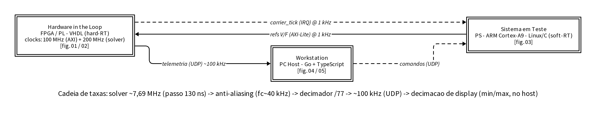

# Diagramas de Arquitetura — HIL

Documentação visual do sistema em **vários níveis**, gerada com
[D2](https://d2lang.com) (diagram-as-code). As fontes `.d2` são versionadas;
as imagens em `img/` são artefatos regeneráveis (SVG para web/edição, PNG para
slides/relatório/TCC).

## Figuras (leitura em ordem)

Cada figura documenta UM subsistema; vizinhos aparecem como caixa-preta (borda
dupla) rotulada com a interface. Lendo as 6 em ordem, o sistema fica explicado
do geral ao específico, sem nenhum bloco detalhado em dois lugares.

| Arquivo | Figura | Possui (detalha) |
|---|---|---|
| `00-system.d2`    | Mapa | Os 3 domínios (caixa-preta) + malha de controle + **cadeia de taxas fim-a-fim** |
| `01-fpga-top.d2`  | FPGA / HIL_AXI_Top | NPC, **domínios 100/200 MHz + CDC**, anti-aliasing, **decimador ÷77**, DMA |
| `02-solver.d2`    | TIM_Solver | Clarke, **bilinear A·X+B·U+Y(X·X)**, **Q14.28**, passo 130 ns, coeficientes |
| `03-ps-daemon.d2` | PS / daemon | Máquina de estados, V/F na ISR, DMA; **regimes ISR 1 kHz vs DMA 100 kHz** |
| `04-backend.d2`   | Backend Go | Ingestão UDP, derive, **pirâmide/decimação de display**, API HTTP/SSE |
| `05-frontend.d2`  | Frontend | main.ts, tiles/cache, viewport/zoom, render scheduler, uPlot |



## Figura adicional — campanha experimental

Fora da sequência de arquitetura acima (00-05, cada uma detalhando um
subsistema do outro): `06-validation-groups.d2` documenta a sequência dos
grupos de ensaio da campanha de validação (S0 → Grupo A → Grupo B), com
status de execução — não parâmetros internos, que ficam na tabela da matriz
de parâmetros do capítulo de resultados (`docs/results-chapter/`).

| Arquivo | Figura | Mostra |
|---|---|---|
| `06-validation-groups.d2` | Sequência de validação experimental | S0 → Grupo A → Grupo B, com status de execução |

**Regra de fronteira:** cada conceito transversal é detalhado só no seu dono —
cadeia de taxas → 00; clocks/CDC/decimador → 01; Q14.28/passo → 02; regimes
temporais → 03; decimação de display → 04.

## Regenerar

```bash
# Pré-requisito (uma vez):
curl -fsSL https://d2lang.com/install.sh | sh -s --

# Gera SVG + PNG de todos os diagramas em img/
./build.sh

# Só SVG (não precisa de chromium headless)
./build.sh svg
```

## Estilo e convenções

Diagramas de bloco acadêmicos: **monocromáticos** (preto/branco/cinza),
blocos retangulares retos, setas ortogonais e grupos tracejados com título.
O layout ortogonal vem do motor **ELK** (`-l elk`, já no `build.sh`); orientação
em paisagem (`direction: right`). Para editar, mexa nas classes no topo de cada `.d2`.

| Elemento | Significado |
|---|---|
| Grupo tracejado (título negrito) | Subsistema / fronteira de domínio (PL, PS, PC) |
| Banda tracejada fina interna | Domínio de clock (ex.: 100 MHz FCLK0 vs 200 MHz MMCM) |
| **Preenchimento cinza** | Domínio rápido do solver (200 MHz) |
| Caixa de borda tracejada | Travessia de clock (CDC) |
| Caixa de **borda dupla** | Vizinho em caixa-preta (detalhado na sua própria figura) |
| Seta **sólida** | Fluxo de dados (telemetria/tiles) |
| Seta **tracejada** | Controle / IRQ / comandos |
| Rótulo na seta | Taxa do estágio (1 kHz, 7,69 MHz, ~100 kHz…) |

Fatos de timing fixados nos diagramas (verificados no RTL/C): solver 200 MHz,
passo 26 ciclos = **130 ns** (~7,69 MHz nativo); portadora NPC **1 kHz** (IRQ p/ PS);
decimador **÷77 → ~100 kHz** após anti-aliasing Butterworth (fc ≈ 40 kHz);
DMA em burst de 128 frames (~1,28 ms); telemetria UDP ~100 kHz; decimação de
display (min/max) no host.

```bash
d2 -l elk --watch 00-system.d2    # edição ao vivo no navegador
```
